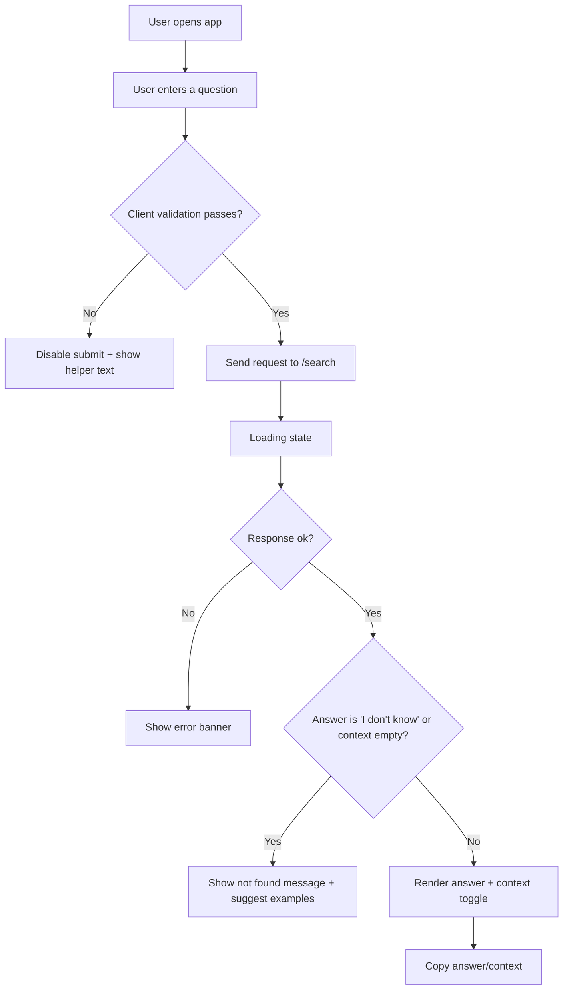

## 1. Product Overview
A single-page web interface that lets a user ask a question about Lagos State tenancy law and receive a model-generated answer plus the exact context chunk used.
- Purpose: make legal information retrieval transparent and easy to use
- Target users: tenants, landlords, agents, and the general public seeking quick guidance from a provided knowledge base

## 2. Core Features

### 2.1 Feature Module
1. **Search page**: query input, submit, results display (answer + context), copy actions

### 2.2 Page Details
| Page Name | Module Name | Feature description |
|-----------|-------------|---------------------|
| Search | Header | App name + short description + backend status indicator |
| Search | Query input | Textarea with label; client validation (trim; 2–500 chars); Cmd/Ctrl+Enter to submit |
| Search | Example queries | Clickable example prompts shown in idle state |
| Search | Loading state | Disable input/button; show spinner + “Searching…” |
| Search | Answer | Large, readable answer block |
| Search | Context panel | Collapsible “Show context” panel; monospace box; keyboard-focusable toggle |
| Search | Copy actions | “Copy answer” and “Copy context” with success feedback |
| Search | Errors | Banner/toast for backend error responses |
| Search | Not found | Friendly “not found in provided context” message when answer is “I don't know” or context is empty |

## 3. Core Process
User flow:
1. User types a question (or picks an example)
2. App validates and sends GET /search?query=...
3. App shows answer and optional context
4. User can expand context and copy content

## 4. User Interface Design
### 4.1 Design Style
- Theme: dark editorial surface with warm “Lagos amber” accent; high contrast for readability
- Typography: distinctive display font for header; refined sans for body; monospace for context
- Layout: centered single-column reading width; generous spacing; strong hierarchy (answer first)
- Interaction: subtle motion (fade/slide-in results), clear focus rings, tactile buttons

### 4.2 Page Design Overview
| Page Name | Module Name | UI Elements |
|-----------|-------------|-------------|
| Search | Header | Title, subtitle, small backend status chip (online/offline) |
| Search | Query input | Textarea, character counter, helper/error text |
| Search | Results | Answer card, context accordion, copy buttons, empty/error banners |

### 4.3 Responsiveness
- Desktop-first layout with a max reading width
- Mobile: stacks controls; larger tap targets; context panel remains scrollable within viewport
