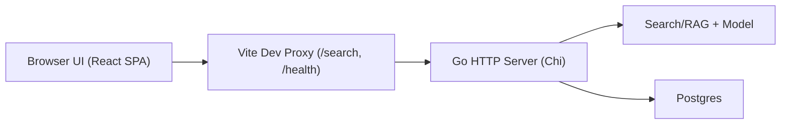

## 1. Architecture Design



## 2. Technology Description
- Frontend: React@18 + TypeScript + Vite
- Styling: Tailwind CSS (utility-first) + a small set of design tokens via CSS variables
- State: React state + a small request hook (no extra state library)
- Networking: fetch() to same-origin paths (/search, /health) via Vite proxy in development
- Backend: existing Go server (Chi), assumed at http://localhost:8080 for local dev

## 3. Route Definitions
| Route | Purpose |
|-------|---------|
| / | Single-page search UI |

## 4. API Definitions (backend exists)

### 4.1 Types
```ts
export type HealthResponse =
  | { status: string; env: string }
  | { error: string }

export type SearchSuccessResponse = {
  data: {
    answer: string
    context: string
  }
}

export type SearchErrorResponse = { error: string }

export type SearchResponse = SearchSuccessResponse | SearchErrorResponse
```

### 4.2 Endpoints
- GET /health
  - 200: { status: "ok", env: "development" }
  - 4xx/5xx: { error: "..." }
- GET /search?query=<string>
  - 200: { data: { answer: string, context: string } }
  - 4xx/5xx: { error: "..." }

## 5. Frontend Module Boundaries
- UI shell: header + layout container
- Query module: textarea, validation, examples, submit handler
- Request module: fetch wrapper that normalizes JSON responses and errors
- Result module: answer rendering, context accordion, copy buttons, banners

## 6. Data Model
Not applicable for the frontend; backend owns persistence (Postgres).
